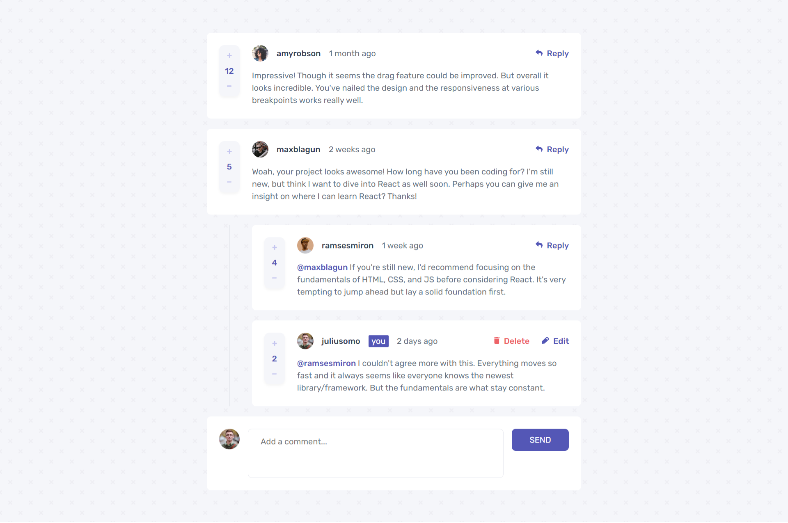

# Frontend Mentor - Interactive comments section solution

This is a solution to the [Interactive comments section challenge on Frontend Mentor](https://www.frontendmentor.io/challenges/interactive-comments-section-iG1RugEG9). Frontend Mentor challenges help you improve your coding skills by building realistic projects.

## Table of contents

- [Overview](#overview)
  - [The challenge](#the-challenge)
  - [Screenshot](#screenshot)
  - [Links](#links)
- [My process](#my-process)
  - [Built with](#built-with)
  - [What I learned](#what-i-learned)
  - [Continued development](#continued-development)
  - [Useful resources](#useful-resources)
- [Author](#author)
- [Acknowledgments](#acknowledgments)

**Note: Delete this note and update the table of contents based on what sections you keep.**

## Overview

This project was a bit challenging for me to complete. I used React and Sass. I tried this 5-6 months ago and frustrated by an issue I stopped working on it but again I started the challenge and voillaa🚀

### The challenge

Users should be able to:

- View the optimal layout for the app depending on their device's screen size
- See hover states for all interactive elements on the page
- Create, Read, Update, and Delete comments and replies
- Upvote and downvote comments

### Screenshot



### Links

- Solution URL: [https://www.frontendmentor.io/solutions/interective-comment-section-using-react-and-scss-CzQL5SyqIC](https://www.frontendmentor.io/solutions/interective-comment-section-using-react-and-scss-CzQL5SyqIC)
- Live Site URL: [https://comment-section-xi.vercel.app/](https://comment-section-xi.vercel.app/)

## My process

- I like to first create the project with npx-create-react-app and remove the unnecessary files and directories
- Then add the directory architecture and check if everthing is working by running the project
- Then I start creating components

### Built with

- Semantic HTML5 markup
- CSS custom properties
- Flexbox
- Sass
- [React](https://reactjs.org/) - JS library

### What I learned

This project taught me alot like:

- How to update data in JSON while rendering the data
- Selecting one particular element
- How to work with nested JSON
- And how to think clearly in the sense of interdependency of different components to pass the data along

This part of the code is what made me stuck 6 months ago😅, which is pretty simple right?

```js
// Editing Comment
function editComment(id, content) {
	const temp = data;

	for (let comment of temp.comments) {
		if (comment.id === id) {
			comment.content = content;
			break;
		} else if (comment?.replies?.length > 0) {
			editReplies(comment.replies, id, content);
		}
	}
	setData({ ...temp });
}
```

### Continued development

I would love to work with more project which requires working with JSON data manipulation as I am not fully comfortable working with it!

### Useful resources

- [Google](https://www.google.com) - This helped me for to find out how I can fix one particular problem if I was facing one!
- [ReactJS Documentation](https://reactjs.org/) - This is an amazing place to learn about a concept of React which helped me finally understand so many things clearly. I'd recommend it to anyone still learning React to make use of this official documentation.

## Author

- Website - [Adarsh Pratap](https://www.github.com/adarshcodes)
- Frontend Mentor - [@adarshcodes](https://www.frontendmentor.io/profile/adarshcodes)
- Twitter - [@yourusername](https://www.twitter.com/ideallyAdarsh)

## Acknowledgments

There is one particular project which helped me a lot to figure out how I can execute a particular functionality was of [@TheDilp](https://www.frontendmentor.io/profile/TheDilp), his code helps me understand how to recursively udpdate the comments! I'm really grateful for his code🙏!
